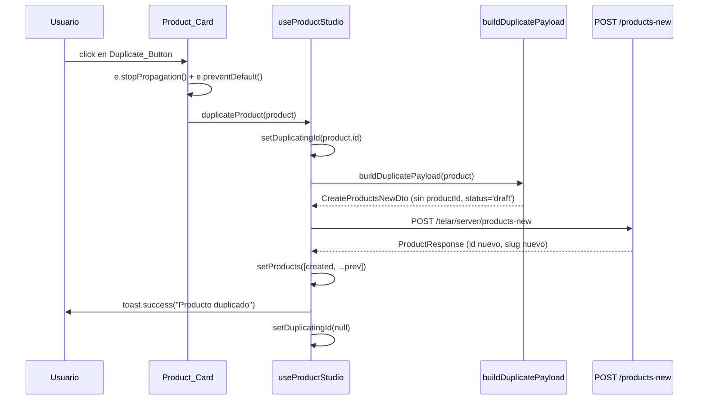

# Design Document — Duplicate Product Studio

## Overview

Esta funcionalidad añade una acción "Duplicar" a cada tarjeta del listado del Product Studio (`ProductStudioPage`). La duplicación es local al frontend: reutiliza el endpoint upsert existente `POST /telar/server/products-new` (sin `productId` = insert) y no requiere cambios en el backend NestJS.

El flujo se compone de tres piezas nuevas del lado del cliente:

1. Una función pura `buildDuplicatePayload(product)` que mapea un `ProductResponse` a un `CreateProductsNewDto` listo para insertar, aplicando las reglas de copia/omisión definidas en Requirement 3.
2. Una función `duplicateProduct(product)` en el hook `useProductStudio` que orquesta payload → POST → refresh → toast, y expone un `duplicatingId` para el estado de carga por tarjeta.
3. Un refactor de la Product_Card en `ProductStudioPage.tsx` de `<button>` a `<div role="button">` (para permitir un `<button>` hijo válido en HTML) que renderiza el nuevo `Duplicate_Button` con estilos responsive (visible siempre en mobile, `opacity-0 group-hover:opacity-100` en desktop).

### Decisiones de diseño clave

- **No cambios en el backend.** El endpoint `POST /products-new` ya funciona como upsert: sin `productId` genera un producto nuevo con `id` y `slug` frescos, respetando `status='draft'` cuando se envía. La lógica de generación de slug ya vive en el service NestJS.
- **Función pura separada del hook.** `buildDuplicatePayload` es una transformación determinista sin efectos. Vive en su propio archivo (`services/duplicateProduct.ts`) y es directamente testeable con property-based testing (round-trips, invariantes de campos copiados/omitidos).
- **Refresh vía inserción optimista.** `createProduct` (que reutilizamos internamente) ya hace `setProducts(prev => [created, ...prev])`, así que el listado refresca sin necesidad de re-fetchear la tienda entera. No exponemos un `refreshProducts` adicional.
- **Loading por producto, no global.** `useProductStudio.saving` es global y bloquearía todo el UI mientras se duplica. Añadimos `duplicatingId: string | null` para bloquear solo la tarjeta que se está duplicando y mantener el resto interactivo.
- **Refactor de la card.** Un `<button>` anidado dentro de otro `<button>` es HTML inválido (los navegadores lo "reparan" cerrando el padre y rompiendo la estructura). La opción con menos ruido visual y mejor accesibilidad es cambiar la card externa a un `<div role="button" tabIndex={0}>` con `onClick` y `onKeyDown` (Enter/Space), permitiendo un `<button>` hijo real para "Duplicar" con su propio `stopPropagation`.
- **Sin cambios en tipos compartidos.** `CreateProductsNewDto` y `ProductResponse` ya cubren todo el mapeo. Solo añadimos tipos internos de la función mapper si son necesarios (probablemente ninguno).

## Architecture

### Flujo de la Duplicate_Action



En caso de error, `duplicateProduct` no altera `products` (el push optimista ocurre solo tras respuesta 2xx), muestra `toast.error("Error al duplicar producto")` y limpia `duplicatingId`.

### Ubicación de los cambios

```
apps/artisans-web/src/
├── hooks/
│   └── useProductStudio.ts              # (mod) + duplicateProduct, duplicatingId
├── services/
│   ├── duplicateProduct.ts              # (nuevo) buildDuplicatePayload
│   └── products-new.types.ts            # (sin cambios)
├── pages/admin/
│   └── ProductStudioPage.tsx            # (mod) refactor card + Duplicate_Button
└── __tests__/
    └── duplicateProduct.property.test.ts # (nuevo) property-based tests
```

## Components and Interfaces

### `buildDuplicatePayload` (nuevo, función pura)

```ts
// services/duplicateProduct.ts
export const COPY_PREFIX = "Copia de ";

/**
 * Convierte un producto del listado en un DTO de creación listo para POST.
 * No muta el argumento. No hace llamadas de red. Determinista.
 */
export function buildDuplicatePayload(
  product: ProductResponse,
): CreateProductsNewDto;
```

Reglas de mapeo:

| Campo destino (DTO)                                            | Origen                      | Regla                                                                                                              |
| -------------------------------------------------------------- | --------------------------- | ------------------------------------------------------------------------------------------------------------------ |
| `productId`                                                    | —                           | **omitido** (INSERT)                                                                                               |
| `storeId`                                                      | `product.storeId`           | copia directa                                                                                                      |
| `name`                                                         | `product.name`              | `COPY_PREFIX + product.name`                                                                                       |
| `status`                                                       | —                           | fijo en `'draft'`                                                                                                  |
| `categoryId`, `subcategoryId`                                  | homónimos                   | copia si presente                                                                                                  |
| `shortDescription`, `history`, `careNotes`, `usageSuggestions` | homónimos                   | copia si presente                                                                                                  |
| `artisanalIdentity`                                            | `product.artisanalIdentity` | mapea los 11 campos listados en Req 3.6; omite `productId`                                                         |
| `physicalSpecs`                                                | `product.physicalSpecs`     | mapea los 4 campos listados en Req 3.7; omite `productId`                                                          |
| `logistics`                                                    | `product.logistics`         | mapea los 8 campos listados en Req 3.8; omite `productId`                                                          |
| `production`                                                   | `product.production`        | mapea los 7 campos listados en Req 3.9; omite `productId`                                                          |
| `media[]`                                                      | `product.media`             | preserva `mediaUrl`, `mediaType`, `isPrimary`, `displayOrder`; omite `id`, `productId`, `createdAt`, `updatedAt`   |
| `materials[]`                                                  | `product.materials`         | preserva `materialId`, `isPrimary`, `materialOrigin`                                                               |
| `variants[]`                                                   | `product.variants`          | preserva los 16 campos listados en Req 3.12; omite `id`, `sku`, `createdAt`, `updatedAt`, `deletedAt`, `productId` |
| `badges[]`                                                     | —                           | **omitido** (Req 3.15)                                                                                             |
| `legacyProductId`                                              | —                           | **omitido** (Req 3.14)                                                                                             |
| Timestamps, `deletedAt`, `slug`, moderación                    | —                           | **omitidos** (Req 3.13, 3.14)                                                                                      |

Comportamiento con capas ausentes: si `product.artisanalIdentity` es `undefined`, la clave `artisanalIdentity` se omite del DTO (no se emite un objeto vacío que pudiera confundir al backend). Idem para `physicalSpecs`, `logistics`, `production`, y para los arrays `media`, `materials`, `variants` (si son `undefined` o vacíos, se omite la clave; el backend interpreta ausencia = sin cambios en esa capa).

### `useProductStudio.duplicateProduct` (nuevo)

```ts
// hooks/useProductStudio.ts (fragmento)
const [duplicatingId, setDuplicatingId] = useState<string | null>(null);

const duplicateProduct = useCallback(
  async (product: ProductResponse): Promise<boolean> => {
    if (duplicatingId) return false; // ignora doble click
    setDuplicatingId(product.id);
    try {
      const dto = buildDuplicatePayload(product);
      const res = await telarApi.post<ProductResponse>("/products-new", dto);
      // Re-lee el detalle: la respuesta del POST es más pobre que el detalle.
      const created = res.data?.id
        ? (await telarApi.get<ProductResponse>(`/products-new/${res.data.id}`))
            .data
        : res.data;
      setProducts((prev) => [created, ...prev]);
      toast.success("Producto duplicado");
      return true;
    } catch {
      toast.error("Error al duplicar producto");
      return false;
    } finally {
      setDuplicatingId(null);
    }
  },
  [duplicatingId],
);
```

Se expone en el return del hook:

```ts
return {
  // ...existente,
  duplicatingId,
  duplicateProduct,
};
```

Nótese que **no** llamamos a `createProduct` internamente porque `createProduct` hace `setSelectedProduct(created)` y `toast.success('Producto creado')`, comportamientos que no queremos en Duplicate (queremos permanecer en el listado y usar el mensaje "Producto duplicado"). Sí replicamos el patrón re-leer detalle + insert optimista.

### `ProductStudioPage` — refactor de la Product_Card

Cambio estructural: el `<button>` externo pasa a `<div role="button" tabIndex={0}>` para poder anidar el `<button>` de duplicar sin violar HTML. Se preservan estilos y accesibilidad.

```tsx
// Antes: <button onClick={() => selectProduct(product.id)}>...</button>
// Después:
<div
  key={product.id}
  role="button"
  tabIndex={0}
  onClick={() => selectProduct(product.id)}
  onKeyDown={(e) => {
    if (e.key === "Enter" || e.key === " ") {
      e.preventDefault();
      selectProduct(product.id);
    }
  }}
  className="group relative rounded-2xl overflow-hidden text-left transition-all cursor-pointer focus:outline-none focus:ring-2 focus:ring-offset-2 focus:ring-[#142239]"
  style={
    {
      /* mismos estilos actuales */
    }
  }
>
  {/* imagen + contenido (idéntico al actual) */}
  <div className="aspect-square bg-slate-100 overflow-hidden"> ... </div>
  <div className="p-3 space-y-1.5"> ... </div>

  {/* Duplicate_Button */}
  <button
    type="button"
    onClick={(e) => {
      e.stopPropagation();
      e.preventDefault();
      duplicateProduct(product);
    }}
    disabled={duplicatingId === product.id}
    aria-label="Duplicar producto"
    className={cn(
      "absolute top-2 right-2 flex items-center gap-1 rounded-full",
      "bg-white/90 backdrop-blur-sm shadow-sm border border-slate-200",
      "px-2 py-1 text-xs font-semibold text-slate-700",
      "hover:bg-white hover:text-slate-900",
      "disabled:opacity-60 disabled:cursor-not-allowed",
      // Responsive: siempre visible en mobile, hover en desktop
      "opacity-100 sm:opacity-0 sm:group-hover:opacity-100",
      "transition-opacity",
    )}
  >
    {duplicatingId === product.id ? (
      <Loader2 className="h-3.5 w-3.5 animate-spin" />
    ) : (
      <Copy className="h-3.5 w-3.5" />
    )}
    <span className="hidden sm:inline">Duplicar</span>
  </button>
</div>
```

Notas de accesibilidad:

- El `div[role="button"]` tiene `tabIndex={0}` y responde a Enter/Space, igualando al `<button>` original.
- Se añade `focus-visible` ring para navegación por teclado.
- El `Duplicate_Button` es un `<button>` real; recibe foco Tab después de la card.
- `aria-label="Duplicar producto"` cubre lectores de pantalla en mobile (donde solo hay icono).
- `disabled` en el botón evita clicks múltiples y bloquea el foco (Req 5.4).

Importaciones nuevas en `ProductStudioPage.tsx`: `Copy` desde `lucide-react`.

## Data Models

### Entradas

**`ProductResponse`** (existente, `services/products-new.types.ts`) — respuesta del backend con todas las capas cargadas. Se usa tal cual sin modificaciones.

### Salidas

**`CreateProductsNewDto`** (existente) — DTO de creación. `buildDuplicatePayload` produce un valor de este tipo con las siguientes garantías estructurales:

```ts
{
  // Presentes siempre:
  storeId: string,           // = product.storeId
  name: string,              // = "Copia de " + product.name
  shortDescription: string,  // = product.shortDescription
  status: 'draft',           // constante

  // Ausentes siempre:
  productId: undefined,
  legacyProductId: undefined,
  badges: undefined,

  // Presentes si el source lo tiene:
  categoryId?, subcategoryId?, history?, careNotes?, usageSuggestions?,
  artisanalIdentity?, physicalSpecs?, logistics?, production?,
  media?, materials?, variants?,
}
```

### Estado nuevo en el hook

```ts
duplicatingId: string | null; // id del producto que se está duplicando, o null
```

## Correctness Properties

_A property is a characteristic or behavior that should hold true across all valid executions of a system-essentially, a formal statement about what the system should do. Properties serve as the bridge between human-readable specifications and machine-verifiable correctness guarantees._

Las propiedades a continuación se agrupan en dos bloques: (a) invariantes de la función pura `buildDuplicatePayload` — verificables con `fast-check` — y (b) invariantes observables del hook + card — verificables con Testing Library y arbitrarios reducidos.

### Property 1: El DTO no contiene claves prohibidas ni identificadores del original

_For any_ `ProductResponse` P, `buildDuplicatePayload(P)` no incluye las claves `productId`, `legacyProductId`, `badges`; y no incluye claves de moderación, `createdAt`, `updatedAt`, `deletedAt` ni `id` en el nivel raíz. Análogamente, ninguna entrada de `dto.media` incluye `id`, `productId`, `createdAt` ni `updatedAt`; ninguna entrada de `dto.variants` incluye `id`, `sku`, `productId`, `createdAt`, `updatedAt` ni `deletedAt`; y las claves emitidas del DTO están todas contenidas en el whitelist declarado en el diseño.

**Validates: Requirements 3.1, 3.13, 3.14, 3.15**

### Property 2: Los campos escalares del core se copian correctamente y `name`/`status` respetan las reglas de duplicación

_For any_ `ProductResponse` P, `buildDuplicatePayload(P)` satisface:

- `dto.storeId === P.storeId`
- `dto.name === "Copia de " + P.name`
- `dto.status === "draft"`
- para cada campo K en `{ categoryId, subcategoryId, shortDescription, history, careNotes, usageSuggestions }`, `dto[K] === P[K]` cuando `P[K]` está definido; y `dto[K]` es `undefined` cuando `P[K]` es `undefined`.

**Validates: Requirements 3.2, 3.3, 3.4, 3.5**

### Property 3: Las capas 1:1 se copian campo a campo y se omiten cuando el source no las tiene

_For any_ `ProductResponse` P y para cada capa L en `{ artisanalIdentity, physicalSpecs, logistics, production }`:

- si `P[L]` está definido, entonces `dto[L]` está definido y `dto[L][K] === P[L][K]` para cada K en la lista declarada de campos copyables de esa capa; y `dto[L]` no contiene claves fuera de esa lista (en particular, no contiene `productId`);
- si `P[L]` es `undefined`, entonces `dto[L]` también es `undefined`.

**Validates: Requirements 3.6, 3.7, 3.8, 3.9**

### Property 4: Las colecciones 1:N preservan longitud, orden y campos declarados

_For any_ `ProductResponse` P y para cada colección C en `{ media, materials, variants }`:

- si `P[C]` es `undefined` o vacío, entonces `dto[C]` es `undefined`;
- en caso contrario, `dto[C].length === P[C].length`, y para cada índice i, `dto[C][i]` contiene exactamente los campos declarados en el diseño con valores iguales a `P[C][i]`, sin claves prohibidas (`id`, `productId`, `sku`, `createdAt`, `updatedAt`, `deletedAt` según corresponda).

**Validates: Requirements 3.10, 3.11, 3.12**

### Property 5: El source no se muta

_For any_ `ProductResponse` P, tras invocar `buildDuplicatePayload(P)`, la representación estructural profunda de P es idéntica a la que tenía antes de la llamada.

**Validates: Requirements 3.1–3.15 (invariante transversal)**

### Property 6: Toda tarjeta del listado expone un Duplicate_Button accesible

_For any_ lista de productos `L` renderizada en `ProductStudioPage`, el DOM contiene exactamente `L.length` elementos accesibles como botón con `aria-label === "Duplicar producto"`, uno por tarjeta.

**Validates: Requirements 1.1, 1.8**

### Property 7: El click en Duplicate_Button no propaga a la navegación de la Product_Card

_For any_ producto p renderizado en el listado, un click sobre su Duplicate_Button no dispara el handler `selectProduct(p.id)` de la card contenedora ni cambia la vista del Product_Studio.

**Validates: Requirements 2.1, 2.2, 2.3**

### Property 8: Éxito de la Duplicate_Action inserta el Duplicated_Product en el listado

_For any_ producto p sobre el que se dispara la Duplicate_Action y para toda respuesta simulada del backend con `id` distinto de los ya presentes, tras `duplicateProduct(p)` la lista `products` contiene el nuevo elemento en la posición inicial (`products[0].id === createdId`), la lista previa se conserva en el resto de posiciones, y `toast.success("Producto duplicado")` fue invocado.

**Validates: Requirements 4.1, 4.3, 4.4**

### Property 9: Fallo de la Duplicate_Action preserva el listado

_For any_ producto p y para todo error simulado (rechazo del `POST`, red caída, 5xx), tras `duplicateProduct(p)` la lista `products` es estructuralmente igual a la lista previa a la acción, y `toast.error("Error al duplicar producto")` fue invocado.

**Validates: Requirement 4.6**

### Property 10: El Loading_State es local, exclusivo y reversible

_For any_ lista de productos y cualquier producto p sobre el que la Duplicate_Action está en curso (`duplicatingId === p.id`):

- el Duplicate_Button de p renderiza el icono spinner (`Loader2`) y su atributo `disabled` es `true`;
- todos los Duplicate_Button de los productos q ≠ p tienen `disabled === false` y renderizan `Copy`;
- tras que la acción termine (éxito o error), `duplicatingId` vuelve a `null`, el botón de p vuelve a `Copy` y `disabled === false`.

**Validates: Requirements 5.1, 5.2, 5.3, 5.5**

## Error Handling

- **Fallo de red / 5xx / validación backend.** `duplicateProduct` captura cualquier error del `telarApi.post`, muestra `toast.error("Error al duplicar producto")`, y no altera `products`. `duplicatingId` se limpia en el `finally`.
- **Fallo del re-fetch de detalle post-POST.** Si el POST responde 2xx pero el `GET /products-new/:id` falla, seguimos con `res.data` (la respuesta cruda del POST) — mismo fallback que ya hace `createProduct`. El producto aparece en el listado con datos parciales; la próxima navegación al detalle disparará el fetch completo.
- **Doble click / click rápido en múltiples cards.** `duplicatingId` es un lock global de acción. Solo permite una duplicación en vuelo. Los clicks en otros botones "Duplicar" mientras hay uno en curso quedan deshabilitados visualmente (`disabled`). Un click en el mismo botón se ignora por el guard `if (duplicatingId) return false`.
- **Card sin capas opcionales.** `buildDuplicatePayload` maneja `undefined` sin propagar errores: cualquier capa ausente resulta en clave omitida en el DTO.
- **Navegación por teclado sobre el div-card.** El handler de `onKeyDown` solo dispara con Enter/Space y llama `preventDefault` para no hacer scroll al pulsar Space. El foco tabular en el `Duplicate_Button` interno mantiene su comportamiento nativo (Enter/Space activan el botón sin propagar al div padre porque el evento no burbujea desde el `onClick` del botón — el `stopPropagation` en el `onClick` cubre el mouse).

## Testing Strategy

**Alcance de PBT.** El feature tiene una parte pura ideal para property-based testing (`buildDuplicatePayload`: transformación determinista con muchas invariantes universales) y una parte de UI + I/O que no lo es. Aplicamos PBT únicamente al mapper. Para el hook y la card usamos tests de ejemplo con Testing Library + mocks.

### Property-based tests (`fast-check` + Vitest)

Objetivo: verificar `buildDuplicatePayload` sobre entradas generadas.

- Generador `arbProductResponse`: `ProductResponse` con capas opcionales presentes o ausentes (`fc.option`), arrays de media/materials/variants de longitud arbitraria, campos string arbitrarios (incluye vacíos y unicode).
- Configuración: `fc.assert(..., { numRuns: 100 })` mínimo por propiedad.
- Cada test lleva un comentario `// Feature: duplicate-product-studio, Property N: <texto>` para trazabilidad al design.

### Unit tests (Vitest + Testing Library)

- **`useProductStudio.duplicateProduct` (mockeando `telarApi`):**
  - éxito → inserta al frente de `products`, muestra toast success, `duplicatingId` vuelve a null.
  - error de red → no altera `products`, muestra toast error, `duplicatingId` vuelve a null.
  - segunda llamada mientras hay una en curso → retorna `false` sin invocar `telarApi.post` una segunda vez.
- **`ProductStudioPage` card:**
  - render con `products` no vacío: cada card renderiza `Duplicate_Button` con `aria-label="Duplicar producto"`.
  - click en `Duplicate_Button` no dispara `selectProduct` (verificar spy o URL no navega).
  - press Enter sobre la card (no sobre el botón) sí dispara `selectProduct`.
  - `duplicatingId === product.id` → botón muestra `Loader2` y está `disabled`.

### Integration/manual smoke

- Duplicar un producto real en staging: verificar que aparece en el listado como `Copia de <nombre>` en estado Borrador y que al abrirlo el wizard trae todas las capas (media, materiales, variantes, etc.) con nuevos IDs.
- Verificar en DevTools que el request enviado no incluye `productId`, `id`, `slug`, `legacyProductId`, `badges`, ni campos de moderación/timestamps.

### Accesibilidad (axe-core en tests existentes)

- Snapshot axe sobre `ProductStudioPage` con listado no vacío para asegurar que el refactor `<button>` → `<div role="button">` no introduce violaciones (foco, contraste del botón semi-transparente, `aria-label` presente).
