# Master Agent Coordinator API

Endpoint principal para coordinar todas las acciones inteligentes del sistema GetInMotion.

## 📍 **Endpoint**

```
POST /telar/server/ai/master-coordinator
```

**Autenticación**: Requiere JWT token válido

---

## 🎯 **Acciones Disponibles**

El Master Coordinator soporta **11 acciones** diferentes:

### 1. **`evolve_tasks`** - Evolucionar Tareas
Analiza tareas completadas y sugiere nuevas basadas en progreso del usuario.

### 2. **`get_coaching_message`** - Mensaje de Coaching
Genera mensaje motivacional personalizado basado en progreso.

### 3. **`analyze_progress`** - Analizar Progreso
Análisis completo del progreso del usuario con métricas y sugerencias.

### 4. **`analyze_and_generate_tasks`** ⭐ - Generar Tareas Personalizadas
**ACCIÓN PRINCIPAL**: Genera 5 tareas ultra-personalizadas usando IA.

### 5. **`start_conversation`** - Iniciar Conversación
Inicia conversación inteligente contextual con el usuario.

### 6. **`generate_intelligent_questions`** - Preguntas Inteligentes
Genera preguntas para enriquecer el perfil empresarial.

### 7. **`create_task_steps`** - Crear Pasos de Tarea
Genera pasos detallados para una tarea específica.

### 8. **`complete_step`** - Completar Paso
Marca un paso como completado y verifica si la tarea está completa.

### 9. **`generate_deliverable`** - Generar Entregable
Crea un documento profesional al completar una tarea.

### 10. **`generate_intelligent_recommendations`** - Recomendaciones
Genera recomendaciones basadas en madurez empresarial.

### 11. **`evaluate_brand_identity`** - Evaluar Identidad de Marca
Evalúa la identidad visual del negocio y genera plan de mejora.

---

## 📝 **Ejemplos de Uso**

### **Ejemplo 1: Generar Tareas Personalizadas** ⭐ (Más Común)

**Request**:
```http
POST /telar/server/ai/master-coordinator
Authorization: Bearer <tu_token_jwt>
Content-Type: application/json

{
  "action": "analyze_and_generate_tasks",
  "userId": "a1b2c3d4-e5f6-7890-abcd-ef1234567890",
  "businessDescription": "Vendo muñecos tejidos personalizados hechos a mano",
  "userProfile": {
    "brandName": "Cositas Lindas",
    "craftType": "tejidos",
    "location": "Ráquira, Boyacá"
  },
  "maturityScores": {
    "ideaValidation": 65,
    "userExperience": 45,
    "marketFit": 70,
    "monetization": 40
  }
}
```

**Response** (200 OK):
```json
{
  "success": true,
  "tasks": [
    {
      "id": "task-uuid-1",
      "userId": "a1b2c3d4-e5f6-7890-abcd-ef1234567890",
      "agentId": "inventory",
      "title": "Define precios para muñecos de Cositas Lindas",
      "description": "Establece una estrategia de precios clara para tus muñecos tejidos considerando materiales, tiempo y mercado local",
      "relevance": "high",
      "status": "pending",
      "priority": 5,
      "createdAt": "2026-01-27T18:00:00Z"
    },
    {
      "id": "task-uuid-2",
      "userId": "a1b2c3d4-e5f6-7890-abcd-ef1234567890",
      "agentId": "growth",
      "title": "Identifica tu cliente ideal para Cositas Lindas",
      "description": "Define quién compra muñecos tejidos personalizados en Ráquira y alrededores",
      "relevance": "high",
      "status": "pending",
      "priority": 4,
      "createdAt": "2026-01-27T18:00:00Z"
    },
    {
      "id": "task-uuid-3",
      "userId": "a1b2c3d4-e5f6-7890-abcd-ef1234567890",
      "agentId": "digital-presence",
      "title": "Activa tu tienda digital de Cositas Lindas",
      "description": "Configura tu tienda online para vender tus muñecos más allá de tu localidad",
      "relevance": "medium",
      "status": "pending",
      "priority": 3,
      "createdAt": "2026-01-27T18:00:00Z"
    },
    {
      "id": "task-uuid-4",
      "userId": "a1b2c3d4-e5f6-7890-abcd-ef1234567890",
      "agentId": "brand",
      "title": "Define la personalidad de marca de Cositas Lindas",
      "description": "Establece los valores y personalidad que quieres transmitir con tus muñecos",
      "relevance": "medium",
      "status": "pending",
      "priority": 3,
      "createdAt": "2026-01-27T18:00:00Z"
    },
    {
      "id": "task-uuid-5",
      "userId": "a1b2c3d4-e5f6-7890-abcd-ef1234567890",
      "agentId": "inventory",
      "title": "Crea tu catálogo de productos de Cositas Lindas",
      "description": "Fotografía y sube tus diferentes tipos de muñecos tejidos al sistema",
      "relevance": "high",
      "status": "pending",
      "priority": 4,
      "createdAt": "2026-01-27T18:00:00Z"
    }
  ],
  "message": "He generado 5 tareas específicas para tu negocio: Vendo muñecos tejidos personalizados hechos a mano"
}
```

---

### **Ejemplo 2: Obtener Mensaje de Coaching**

**Request**:
```json
{
  "action": "get_coaching_message",
  "userId": "a1b2c3d4-e5f6-7890-abcd-ef1234567890",
  "currentTasks": [
    { "id": "task-1", "title": "Tarea pendiente 1" },
    { "id": "task-2", "title": "Tarea pendiente 2" }
  ],
  "completedTasks": [
    { "id": "task-3", "title": "Tarea completada 1" },
    { "id": "task-4", "title": "Tarea completada 2" },
    { "id": "task-5", "title": "Tarea completada 3" }
  ],
  "maturityScores": {
    "ideaValidation": 75,
    "userExperience": 60,
    "marketFit": 80,
    "monetization": 55
  }
}
```

**Response**:
```json
{
  "message": "¡Hola! ¡Vas genial! Has completado 3 tareas. Cada paso te acerca más a tu objetivo.",
  "stats": {
    "currentTasks": 2,
    "completedTasks": 3
  }
}
```

---

### **Ejemplo 3: Crear Pasos para una Tarea**

**Request**:
```json
{
  "action": "create_task_steps",
  "userId": "a1b2c3d4-e5f6-7890-abcd-ef1234567890",
  "taskId": "task-uuid-123",
  "taskData": {
    "title": "Define precios para muñecos de Cositas Lindas",
    "description": "Establece una estrategia de precios clara",
    "agent_id": "inventory"
  },
  "profileContext": {
    "businessName": "Cositas Lindas",
    "craftType": "muñecos tejidos",
    "location": "Ráquira, Boyacá"
  }
}
```

**Response**:
```json
{
  "success": true,
  "steps": [
    {
      "id": "step-uuid-1",
      "taskId": "task-uuid-123",
      "stepNumber": 1,
      "title": "Lista todos los tipos de muñecos que tejes",
      "description": "Identifica las categorías: bebés, animales, personajes, tamaños",
      "inputType": "text",
      "validationCriteria": "Al menos 3 categorías",
      "aiContextPrompt": "Ayuda al usuario a categorizar sus productos",
      "completionStatus": "pending",
      "createdAt": "2026-01-27T18:00:00Z"
    },
    {
      "id": "step-uuid-2",
      "taskId": "task-uuid-123",
      "stepNumber": 2,
      "title": "Calcula el costo de materiales para cada tipo",
      "description": "Suma lanas, relleno, accesorios por tipo de muñeco",
      "inputType": "number",
      "validationCriteria": "Costos positivos en pesos colombianos",
      "aiContextPrompt": "Guía al usuario en el cálculo de costos",
      "completionStatus": "pending",
      "createdAt": "2026-01-27T18:00:00Z"
    },
    {
      "id": "step-uuid-3",
      "taskId": "task-uuid-123",
      "stepNumber": 3,
      "title": "Cronometra tu tiempo de tejido",
      "description": "Mide cuánto tardas en tejer cada tipo de muñeco",
      "inputType": "number",
      "validationCriteria": "Tiempo en horas",
      "aiContextPrompt": "Ayuda a valorar el trabajo artesanal",
      "completionStatus": "pending",
      "createdAt": "2026-01-27T18:00:00Z"
    },
    {
      "id": "step-uuid-4",
      "taskId": "task-uuid-123",
      "stepNumber": 4,
      "title": "Define tu ganancia deseada por hora",
      "description": "¿Cuánto quieres ganar por hora de trabajo?",
      "inputType": "number",
      "validationCriteria": "Valor justo por tu trabajo",
      "aiContextPrompt": "Ayuda a establecer valor justo del trabajo",
      "completionStatus": "pending",
      "createdAt": "2026-01-27T18:00:00Z"
    }
  ],
  "message": "He creado 4 pasos específicos para tu tarea."
}
```

---

### **Ejemplo 4: Evaluar Identidad de Marca**

**Request**:
```json
{
  "action": "evaluate_brand_identity",
  "userId": "a1b2c3d4-e5f6-7890-abcd-ef1234567890",
  "wizardData": {
    "¿Ya tienes un logo para tu negocio?": "Tengo uno pero no estoy seguro si es bueno",
    "¿Tienes colores corporativos definidos?": "Uso colores pero sin sistema",
    "¿Tienes un slogan o claim definido?": "No tengo",
    "¿Dónde usas tu identidad actualmente?": ["Instagram", "Etiquetas de productos"]
  }
}
```

**Response**:
```json
{
  "success": true,
  "analysis": {
    "score": 52,
    "summary": "Tu identidad visual está en desarrollo. Tienes bases (logo y presencia en redes) pero falta coherencia y definición estratégica.",
    "strengths": [
      "Ya tienes un logo, es un buen punto de partida",
      "Usas tu marca en Instagram y productos físicos",
      "Reconoces áreas de mejora en tu identidad actual"
    ],
    "weaknesses": [
      "El logo actual genera dudas, probablemente necesita refinamiento",
      "Colores sin sistema dificultan la coherencia de marca",
      "Sin claim pierdes oportunidad de comunicar tu propuesta de valor"
    ],
    "recommendations": [
      {
        "priority": "high",
        "title": "Refina tu logo con criterios profesionales",
        "description": "Evalúa legibilidad, versatilidad (blanco/negro, pequeño/grande), y conexión con tu craft. Considera ajustes antes de invertir en nueva identidad.",
        "impact": "Un logo profesional aumenta percepción de calidad en 40%",
        "effort": "1-2 horas"
      },
      {
        "priority": "high",
        "title": "Define paleta de colores corporativa",
        "description": "Selecciona 2-3 colores principales basados en psicología del color y tu tipo de artesanía. Documéntalos con códigos hex.",
        "impact": "Coherencia visual mejora reconocimiento de marca en 80%",
        "effort": "30 min - 1 hora"
      },
      {
        "priority": "medium",
        "title": "Crea un claim que comunique tu esencia",
        "description": "Frase corta (5-7 palabras) que exprese qué hace único tu trabajo. Ejemplo: 'Tejidos con alma, hechos para durar'",
        "impact": "Diferenciación clara frente a competencia",
        "effort": "1 hora"
      }
    ],
    "next_steps": [
      "Pide feedback sobre tu logo actual a 5-10 clientes",
      "Investiga paletas de colores de marcas artesanales que admiras",
      "Escribe 5 frases que describan tu trabajo y elige la más auténtica"
    ]
  },
  "message": "Evaluación completada exitosamente"
}
```

---

### **Ejemplo 5: Analizar Progreso del Usuario**

**Request**:
```json
{
  "action": "analyze_progress",
  "userId": "a1b2c3d4-e5f6-7890-abcd-ef1234567890",
  "maturityScores": {
    "ideaValidation": 75,
    "userExperience": 60,
    "marketFit": 80,
    "monetization": 55
  }
}
```

**Response**:
```json
{
  "totalTasks": 12,
  "completedTasks": 7,
  "completionRate": 58.33,
  "maturityScores": {
    "ideaValidation": 75,
    "userExperience": 60,
    "marketFit": 80,
    "monetization": 55
  },
  "recentActivity": [
    {
      "id": "task-uuid-1",
      "title": "Define precios para productos",
      "status": "completed",
      "completedAt": "2026-01-27T15:00:00Z"
    },
    {
      "id": "task-uuid-2",
      "title": "Crea perfil de cliente ideal",
      "status": "completed",
      "completedAt": "2026-01-26T18:30:00Z"
    }
  ],
  "suggestions": [
    "Considera revisar tu estrategia de negocio",
    "Es momento de pensar en escalar operaciones",
    "Explora herramientas avanzadas y automatización"
  ]
}
```

---

## 🚫 **Agentes Permitidos**

El Master Coordinator **SOLO** permite estos 4 agentes:

| Agente ID | Descripción |
|-----------|-------------|
| `growth` | Crecimiento inicial, diagnóstico, público objetivo |
| `inventory` | Productos, catálogo, inventario, tienda |
| `digital-presence` | Visibilidad online, tienda digital |
| `brand` | Identidad visual, logo, colores, claim |

**Agentes bloqueados** (hasta desarrollo completo):
- `pricing`
- `legal`
- `financial-management`
- `marketing-specialist`
- `operations-specialist`
- `cultural-consultant`
- `business-intelligence`
- `expansion-specialist`
- `personal-brand-eval`

---

## ⚠️ **Respuestas de Error**

### **400 Bad Request** - Acción inválida
```json
{
  "statusCode": 400,
  "message": "Acción desconocida: invalid_action",
  "error": "Bad Request"
}
```

### **400 Bad Request** - Agente no permitido
```json
{
  "statusCode": 400,
  "message": "Agente no permitido: pricing. Usa: growth, inventory, digital-presence, brand",
  "error": "Bad Request"
}
```

### **400 Bad Request** - Parámetros faltantes
```json
{
  "statusCode": 400,
  "message": "taskId y taskData son requeridos para create_task_steps",
  "error": "Bad Request"
}
```

### **401 Unauthorized** - Sin token
```json
{
  "statusCode": 401,
  "message": "No autorizado",
  "error": "Unauthorized"
}
```

### **500 Internal Server Error** - Error de procesamiento
```json
{
  "statusCode": 500,
  "message": "Error al generar tareas personalizadas",
  "error": "Internal Server Error"
}
```

---

## 🎯 **Flujo Típico de Uso**

### **1. Usuario Nuevo - Onboarding**

```mermaid
graph LR
    A[Registrar Usuario] --> B[analyze_and_generate_tasks]
    B --> C[Crear 5 tareas personalizadas]
    C --> D[create_task_steps para cada tarea]
    D --> E[Usuario completa pasos]
    E --> F[complete_step]
    F --> G{¿Tarea completa?}
    G -->|Sí| H[generate_deliverable]
    G -->|No| E
    H --> I[get_coaching_message]
```



### **2. Usuario Activo - Evolución**

```mermaid
graph LR
    A[Usuario completa tareas] --> B[analyze_progress]
    B --> C[evolve_tasks]
    C --> D[Nuevas tareas sugeridas]
    D --> E[Usuario acepta tareas]
    E --> F[create_task_steps]
    F --> G[Ciclo continúa]
```



### **3. Usuario Avanzado - Optimización**

```mermaid
graph LR
    A[Usuario maduro] --> B[evaluate_brand_identity]
    B --> C[Generar plan de mejora]
    C --> D[generate_intelligent_recommendations]
    D --> E[Tareas de optimización]
    E --> F[Entregables avanzados]
```



---

## 📊 **Campos del DTO Principal**

| Campo | Tipo | Requerido | Descripción |
|-------|------|-----------|-------------|
| `action` | enum | Sí | Acción a ejecutar |
| `userId` | UUID | Sí | ID del usuario |
| `completedTasks` | Array | No | Tareas completadas |
| `maturityScores` | Object | No | Puntuaciones de madurez |
| `userProfile` | Object | No | Perfil del usuario |
| `currentTasks` | Array | No | Tareas actuales |
| `businessDescription` | String | No | Descripción del negocio |
| `conversationContext` | String | No | Contexto de conversación |
| `taskId` | UUID | No | ID de tarea (para create_task_steps) |
| `taskData` | Object | No | Datos de tarea |
| `profileContext` | Object | No | Contexto del perfil |
| `stepId` | UUID | No | ID de paso (para complete_step) |
| `stepData` | Object | No | Datos del paso |
| `language` | String | No | Idioma ('es' o 'en') |
| `wizardData` | Object | No | Datos de wizard (para evaluate_brand_identity) |

---

## 🔗 **Integración con Frontend**

### **Ejemplo con Axios**

```typescript
import axios from 'axios';

const masterCoordinator = async (action: string, data: any) => {
  try {
    const response = await axios.post(
      '/telar/server/ai/master-coordinator',
      {
        action,
        userId: currentUser.id,
        ...data,
      },
      {
        headers: {
          Authorization: `Bearer ${accessToken}`,
        },
      }
    );
    
    return response.data;
  } catch (error) {
    console.error('Master Coordinator Error:', error);
    throw error;
  }
};

// Uso
const generateTasks = async () => {
  const result = await masterCoordinator('analyze_and_generate_tasks', {
    businessDescription: 'Mi negocio de artesanías',
    maturityScores: { ideaValidation: 70, ... }
  });
  
  console.log('Tareas generadas:', result.tasks);
};
```

---

## ✅ **Estado del Endpoint**

- ✅ Migración completa (todas las tablas existen)
- ✅ DTOs completos con validación
- ✅ MasterCoordinatorService implementado (11 acciones)
- ✅ OpenAIService integrado
- ✅ Endpoint en AI Controller
- ✅ Documentación Swagger completa
- ✅ Sin errores de linter
- ✅ Validación de agentes permitidos
- ✅ Manejo de errores robusto

¡El endpoint está **listo para producción**! 🚀
