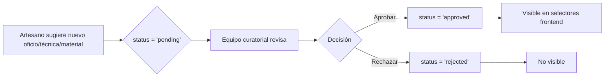

# Sistema de Productos Multicapa - Telar.co

**Taxonomías, EAV y Estructura por Capas**

---

## 📋 Tabla de Contenidos

1. [Resumen Ejecutivo](#1-resumen-ejecutivo)
2. [Comparación: Antes vs. Después](#2-comparación-antes-vs-después)
3. [Arquitectura General](#3-arquitectura-general)
4. [Sistema de Taxonomías](#4-sistema-de-taxonomías)
5. [Producto Multicapa](#5-producto-multicapa)
6. [Sistema EAV (Entity-Attribute-Value)](#6-sistema-eav-entity-attribute-value)
7. [Variantes y Precios](#7-variantes-y-precios)
8. [Categorías y Atributos](#8-categorías-y-su-relación-con-atributos)
9. [Consideraciones Técnicas](#9-consideraciones-técnicas)
10. [Migración y Endpoints](#10-migración-y-endpoints)

---

## 1. Resumen Ejecutivo

Este documento describe la **nueva arquitectura de datos** para el sistema de productos de Telar, reemplazando el modelo plano actual (una tabla `shop.products` con ~30 columnas y múltiples campos JSONB) por una **estructura normalizada por capas** que separa responsabilidades, habilita atributos dinámicos mediante EAV y conecta con taxonomías curadas.

### 🎯 Objetivos Principales

- ✅ Eliminar la dependencia de campos JSONB no tipados para datos críticos (materiales, técnicas, imágenes, dimensiones)
- ✅ Permitir atributos dinámicos por categoría (talla, color, tipo de tela) sin modificar el esquema de base de datos
- ✅ Separar la información de producto en capas especializadas (identidad artesanal, logística, producción, etc.)
- ✅ Normalizar las tiendas con perfiles, contactos y premios en tablas independientes
- ✅ Establecer un catálogo de taxonomías curadas (oficios, técnicas, materiales) que garantice consistencia en toda la plataforma

---

## 2. Comparación: Antes vs. Después

### 2.1 ❌ Problemas del Modelo Actual

| Problema | Descripción |
|----------|-------------|
| **Tabla Monolítica** | `shop.products` contiene ~30 columnas con responsabilidades mezcladas (precio, inventario, dimensiones, materiales, SEO, moderación) |
| **JSONB Sin Validación** | Campos como `materials`, `techniques`, `images` y `dimensions` son JSONB sin validación ni integridad referencial |
| **Configuración Mezclada** | `shop.artisan_shops` tiene ~40 columnas con mucha configuración en JSONB (`hero_config`, `about_content`, `contact_config`) |
| **Variantes Ineficientes** | `public.product_variants` usa `option_values` JSONB para definir las variaciones, impidiendo consultas eficientes por atributo |
| **Sin Catálogo Normalizado** | No existe un catálogo normalizado de oficios, técnicas o materiales — son texto libre que puede tener inconsistencias |

### 2.2 ✅ Beneficios del Nuevo Modelo

| Beneficio | Descripción |
|-----------|-------------|
| **Integridad Referencial** | Materiales, técnicas y oficios son FK a catálogos curados con aprobación |
| **Flexibilidad** | El EAV permite agregar atributos nuevos (ej: 'talla manga') sin `ALTER TABLE` |
| **Consultas Eficientes** | Índices específicos por capa, sin escanear una tabla monolítica |
| **Precios Precisos** | Precios en minor units (centavos) como BIGINT, eliminando errores de punto flotante |
| **Soft Delete** | Uso de `deleted_at` en las tablas principales, habilitando recuperación de datos |

### 📊 Diagrama de Transformación

```
ANTES (Producción Actual)              DESPUÉS (Propuesta v1)
┌─────────────────────────┐            ┌──────────────────────┐
│   shop.products         │            │  products_core       │
│  ~30 columnas           │ ───────>   │  (datos mínimos)     │
│                         │            └──────────────────────┘
│  - materials JSONB []   │                      │
│  - techniques JSONB []  │            ┌─────────┴────────────┐
│  - images JSONB []      │            │                      │
│  - dimensions JSONB {}  │      ┌─────▼──────┐    ┌────────▼──────┐
│  - weight, sku, inv...  │      │ product_   │    │ product_      │
│  ~30 columnas           │      │ artisanal_ │    │ physical_     │
└─────────────────────────┘      │ identity   │    │ specs         │
                                 └────────────┘    └───────────────┘
┌─────────────────────────┐              │                │
│ public.product_variants │      ┌───────▼────────┐  ┌───▼──────────┐
│  - option_values JSONB  │      │ product_       │  │ product_     │
│  DIFICULTA CONSULTAS    │      │ logistics      │  │ production   │
└─────────────────────────┘      └────────────────┘  └──────────────┘
                                          │                │
┌─────────────────────────┐      ┌───────▼────────┐  ┌───▼──────────┐
│ shop.artisan_shops      │      │ product_media  │  │ product_     │
│  - ~40 columnas         │      │ (normalizada)  │  │ materials_   │
│  - Muchos JSONB         │      └────────────────┘  │ link (N:M)   │
└─────────────────────────┘                          └──────────────┘
                                          │
                                 ┌────────▼──────────┐
                                 │ product_variants  │
                                 │ (precio en minor, │
                                 │  EAV en tabla)    │
                                 └───────────────────┘
                                          │
                                 ┌────────▼──────────┐
                                 │ EAV: attributes + │
                                 │ option + values   │
                                 │ (Categorías→Sets) │
                                 └───────────────────┘
                                          │
                                 ┌────────▼──────────┐
                                 │ taxonomy:         │
                                 │ Catálogos Curados │
                                 └───────────────────┘
```

---

## 3. Arquitectura General

La nueva estructura se organiza en **4 esquemas (schemas)** de PostgreSQL, cada uno con una responsabilidad clara:

### 📂 Esquemas de Base de Datos

| Schema | Propósito | Tablas Principales |
|--------|-----------|-------------------|
| **`taxonomy`** | Catálogos globales curados por el equipo. Son compartidos entre todas las tiendas. | `crafts`, `techniques`, `materials`, `badges`, `care_tags`, `curatorial_categories` |
| **`shop`** | Tiendas, productos, categorías, variantes y el sistema EAV de atributos dinámicos. | `stores`, `products_core`, `product_variants`, `attributes`, `product_categories` |
| **`payments`** | Carrito, checkout, órdenes y transacciones (sin cambios estructurales). | `carts`, `checkouts`, `orders`, `product_prices` |
| **`digital_identity`** | Sistema de identidad digital y NFTs (footprints) | `footprints`, `metadata_versions` |

### 🔗 Diagrama de Relaciones

```
┌─────────────────────────────────────────────────────────────────┐
│                    Schema: taxonomy                             │
│  ┌──────────┐  ┌───────────┐  ┌───────────┐  ┌────────┐       │
│  │ crafts   │  │techniques │  │ materials │  │ badges │       │
│  └────┬─────┘  └─────┬─────┘  └─────┬─────┘  └───┬────┘       │
└───────┼──────────────┼──────────────┼────────────┼─────────────┘
        │              │              │            │
        │              │              │            │
┌───────▼──────────────▼──────────────▼────────────▼─────────────┐
│                    Schema: shop                                 │
│  ┌─────────────┐           ┌──────────────────┐                │
│  │   stores    │           │ products_core    │                │
│  └──────┬──────┘           └────────┬─────────┘                │
│         │                           │                           │
│         │         ┌─────────────────┼─────────────────┐        │
│         │         │                 │                 │        │
│  ┌──────▼──────┐  │  ┌──────────────▼────┐  ┌────────▼──────┐ │
│  │store_       │  │  │product_artisanal_ │  │product_       │ │
│  │artisanal_   │  │  │identity (1:1)     │  │physical_specs │ │
│  │profiles     │  │  └───────────────────┘  │(1:1)          │ │
│  └─────────────┘  │  ┌───────────────────┐  └───────────────┘ │
│                   │  │product_logistics  │                     │
│  ┌─────────────┐  │  │(1:1)              │  ┌───────────────┐ │
│  │product_     │  │  └───────────────────┘  │product_       │ │
│  │variants     │  │  ┌───────────────────┐  │production     │ │
│  │             │  │  │product_media      │  │(1:1)          │ │
│  └──────┬──────┘  │  │(1:N)              │  └───────────────┘ │
│         │         │  └───────────────────┘                     │
│         │         │                                            │
│  ┌──────▼──────────▼───────────────────────────────────────┐  │
│  │           Sistema EAV                                    │  │
│  │  ┌────────────┐  ┌──────────────┐  ┌─────────────────┐ │  │
│  │  │attributes  │  │category_     │  │product_         │ │  │
│  │  │            │  │attribute_sets│  │attribute_values │ │  │
│  │  └────────────┘  └──────────────┘  └─────────────────┘ │  │
│  │  ┌────────────┐  ┌─────────────────────────────────┐   │  │
│  │  │attribute_  │  │variant_attribute_values         │   │  │
│  │  │options     │  │                                 │   │  │
│  │  └────────────┘  └─────────────────────────────────┘   │  │
│  └──────────────────────────────────────────────────────────┘  │
└─────────────────────────────────────────────────────────────────┘
```

---

## 4. Sistema de Taxonomías

El esquema `taxonomy` es la **fuente de verdad** para oficios, técnicas, materiales, insignias y etiquetas de cuidado. Todas las tiendas y productos referencian estos catálogos mediante foreign keys.

### 4.1 🎨 Oficios y Técnicas

#### `taxonomy.crafts`

Representa los **oficios artesanales** (ej: Tejeduría, Cerámica, Talla en madera).

**Campos clave:**
- `name` - Nombre del oficio (UNIQUE)
- `status` - Estado de aprobación: `'pending'`, `'approved'`, `'rejected'`
- `suggested_by` - UUID del artesano que sugirió el oficio (FK a `auth.users`)

#### `taxonomy.techniques`

Relación **N:1** con `crafts`. Una técnica pertenece a un oficio específico.

**Ejemplo:** El oficio 'Tejeduría' tiene técnicas como:
- Telar horizontal
- Macramé
- Crochet
- Telar vertical

**Constraint:** `UNIQUE(craft_id, name)` evita técnicas duplicadas dentro del mismo oficio.

### 4.2 🧵 Materiales

#### `taxonomy.materials`

Catálogo independiente de materiales con flags de sostenibilidad.

**Campos clave:**
- `name` - Nombre del material (UNIQUE)
- `is_organic` - Booleano (material orgánico)
- `is_sustainable` - Booleano (material sostenible)
- `status` - Estado de aprobación
- `suggested_by` - Artesano que sugirió el material

**Relación con productos:**
Los productos se conectan a materiales mediante la tabla puente `shop.product_materials_link`, que permite:
- Indicar cuál es el material primario (`is_primary`)
- Especificar el origen geográfico (`material_origin`)

### 4.3 🏅 Insignias (Badges)

#### `taxonomy.badges`

Reconocimientos que pueden asignarse tanto a tiendas como a productos.

**Campos clave:**
- `code` - Código único (ej: `'artesania_premiada'`)
- `target_type` - `'shop'` o `'product'`
- `assignment_type` - `'curated'` (manual) o `'automated'` (por reglas)
- `icon_url` - URL del ícono del badge

**Tablas de asignación:**
- `shop.store_badges` - Badges asignados a tiendas
- `shop.product_badges` - Badges asignados a productos

### 4.4 ✅ Flujo de Aprobación



**Campo:** `taxonomy_approval_status` ENUM
- `'pending'` - En revisión
- `'approved'` - Aprobado, visible en frontend
- `'rejected'` - Rechazado

---

## 5. Producto Multicapa

El corazón de la nueva arquitectura es la **descomposición del producto en capas especializadas**. Cada capa es una tabla separada conectada a `products_core` mediante una relación **1:1** (usando `product_id` como PK y FK simultáneamente).

### 📊 Capas del Producto

| Tabla (Capa) | Relación | Responsabilidad |
|--------------|----------|-----------------|
| **`products_core`** | Base | Nombre, descripción, historia, estado de publicación. Es la tabla padre de todo producto. |
| **`product_artisanal_identity`** | 1:1 | Oficio, técnica, estilo, tipo de pieza, proceso. Conecta con `taxonomy.crafts` y `taxonomy.techniques`. |
| **`product_materials_link`** | N:M | Puente a `taxonomy.materials`. Permite múltiples materiales con indicador de primario y origen. |
| **`product_physical_specs`** | 1:1 | Dimensiones reales del producto: alto, ancho, largo/diámetro, peso real. |
| **`product_logistics`** | 1:1 | Dimensiones de empaque, tipo de empaque, fragilidad, ensamblaje y protección especial. |
| **`product_production`** | 1:1 | Disponibilidad (`en_stock`, `bajo_pedido`, `edicion_limitada`), tiempo de producción, capacidad mensual. |
| **`product_media`** | 1:N | Imágenes y videos normalizados con orden de display e indicador de imagen principal. |
| **`product_care_tags`** | N:M | Etiquetas de cuidado del producto (lavar a mano, no planchar, etc.). |
| **`product_badges`** | N:M | Insignias asignadas al producto (artesanía premiada, orgánico, etc.). |

### 5.1 📦 `products_core` — El Núcleo

Contiene solo la información **esencial e inmutable** de un producto.

**Campos:**
```sql
CREATE TABLE shop.products_core (
    id UUID PRIMARY KEY DEFAULT uuid_generate_v4(),
    store_id UUID NOT NULL REFERENCES shop.stores(id) ON DELETE CASCADE,
    category_id UUID REFERENCES taxonomy.categories(id),
    name TEXT NOT NULL,
    short_description TEXT NOT NULL,
    history TEXT NULL,
    care_notes TEXT NULL,
    status TEXT NOT NULL DEFAULT 'draft'
        CHECK (status IN ('draft', 'pending_moderation', 'changes_requested',
                          'approved', 'approved_with_edits', 'rejected')),
    legacy_product_id UUID NULL,
    created_at TIMESTAMPTZ NOT NULL DEFAULT now(),
    updated_at TIMESTAMPTZ DEFAULT now(),
    deleted_at TIMESTAMPTZ DEFAULT NULL
);
```

**Estados del producto:**
- `draft` - Borrador, aún en edición
- `pending_moderation` - Enviado para revisión
- `changes_requested` - Moderador solicitó cambios
- `approved` - Aprobado para publicación
- `approved_with_edits` - Aprobado con ediciones del moderador
- `rejected` - Rechazado

### 5.2 🎨 `product_artisanal_identity` — La Identidad

Captura todo lo que hace **único** a un producto artesanal.

**Campos:**
```sql
CREATE TABLE shop.product_artisanal_identity (
    product_id UUID PRIMARY KEY
        REFERENCES shop.products_core(id) ON DELETE CASCADE,
    primary_craft_id UUID REFERENCES taxonomy.crafts(id),
    primary_technique_id UUID REFERENCES taxonomy.techniques(id),
    secondary_technique_id UUID REFERENCES taxonomy.techniques(id),
    curatorial_category_id UUID REFERENCES taxonomy.curatorial_categories(id),
    piece_type shop_piece_type, -- ENUM: 'funcional', 'decorativa', 'mixta'
    style shop_style,            -- ENUM: 'tradicional', 'contemporaneo', 'fusion'
    is_collaboration BOOLEAN DEFAULT false,
    process_type product_process_type, -- ENUM: 'manual', 'mixto', 'asistido'
    estimated_elaboration_time TEXT NULL,
    CONSTRAINT different_techniques
        CHECK (primary_technique_id IS DISTINCT FROM secondary_technique_id)
);
```

### 5.3 📐 Capas de Logística y Producción

#### `product_physical_specs`
```sql
CREATE TABLE shop.product_physical_specs (
    product_id UUID PRIMARY KEY REFERENCES shop.products_core(id) ON DELETE CASCADE,
    height_cm NUMERIC(8,2) NULL,
    width_cm NUMERIC(8,2) NULL,
    length_or_diameter_cm NUMERIC(8,2) NULL,
    real_weight_kg NUMERIC(8,2) CHECK (real_weight_kg >= 0)
);
```

#### `product_logistics`
```sql
CREATE TABLE shop.product_logistics (
    product_id UUID PRIMARY KEY REFERENCES shop.products_core(id) ON DELETE CASCADE,
    packaging_type TEXT NULL,
    pack_height_cm NUMERIC(8,2) NULL,
    pack_width_cm NUMERIC(8,2) NULL,
    pack_length_cm NUMERIC(8,2) NULL,
    pack_weight_kg NUMERIC(8,2) NULL,
    fragility fragility_level DEFAULT 'medio', -- ENUM: 'bajo', 'medio', 'alto'
    requires_assembly BOOLEAN DEFAULT false,
    special_protection_notes TEXT NULL
);
```

#### `product_production`
```sql
CREATE TABLE shop.product_production (
    product_id UUID PRIMARY KEY REFERENCES shop.products_core(id) ON DELETE CASCADE,
    availability_type product_availability NOT NULL,
        -- ENUM: 'en_stock', 'bajo_pedido', 'edicion_limitada'
    production_time_days INTEGER CHECK (production_time_days >= 0),
    monthly_capacity INTEGER CHECK (monthly_capacity >= 0),
    requirements_to_start TEXT NULL
);
```

---

## 6. Sistema EAV (Entity-Attribute-Value)

El patrón EAV permite definir **atributos dinámicos** sin modificar el esquema de base de datos. En lugar de agregar columnas por cada atributo nuevo (talla, color, material de la suela, tipo de cuello), se usa un diccionario de atributos y tablas de valores.

### 🗂️ Componentes del EAV

| Tabla | Función en el EAV |
|-------|-------------------|
| **`shop.attributes`** | Diccionario global de atributos. Define `code` único (ej: 'talla', 'color', 'tipo_tela'), tipo de UI (`select`, `color_picker`, `text`), tipo de dato (`string`, `number`, `boolean`) y unidad opcional. |
| **`shop.attribute_options`** | Opciones predefinidas para atributos tipo select/color. Ej: para 'talla' las opciones son S, M, L, XL. |
| **`shop.category_attribute_sets`** | Configura qué atributos aplican a cada categoría. Define si el atributo es eje de variante (`is_variant_axis`) y en qué etapa es requerido (`draft`, `footprint`, `publish`). |
| **`shop.product_attribute_values`** | Valores a nivel de producto base. Para atributos que NO son eje de variante. Ej: `tipo_tela = 'Algodón'` aplica al producto entero. |
| **`shop.variant_attribute_values`** | Valores a nivel de variante (SKU). Para atributos marcados como `is_variant_axis`. Ej: cada variante tiene su combinación de color + talla. |

### 📋 Flujo de Configuración EAV

```
┌─────────────────────┐
│  1. Categoría       │
│  product_categories │
│  Ej: Ropa Artesanal │
└──────────┬──────────┘
           │
           ▼
┌─────────────────────────────────┐
│  2. Diccionario de Atributos    │
│  ┌──────────────────────────┐   │
│  │ attributes: 'tipo_tela'  │   │
│  │ ui_type: 'text'          │   │
│  │ data_type: 'string'      │   │
│  └──────────────────────────┘   │
│  ┌──────────────────────────┐   │
│  │ attributes: 'talla'      │   │
│  │ ui_type: 'select'        │   │
│  │ data_type: 'string'      │   │
│  └──────────────────────────┘   │
│  ┌──────────────────────────┐   │
│  │ attributes: 'color'      │   │
│  │ ui_type: 'color_picker'  │   │
│  │ data_type: 'string'      │   │
│  └──────────────────────────┘   │
└───────────────┬─────────────────┘
                │
                ▼
┌──────────────────────────────────┐
│  4. Configuración por Categoría  │
│  category_attribute_sets         │
│  ┌────────────────────────────┐  │
│  │ tipo_tela → Ropa           │  │
│  │ is_variant_axis: FALSE     │  │
│  │ required_at: draft         │  │
│  └────────────────────────────┘  │
│  ┌────────────────────────────┐  │
│  │ color → Ropa               │  │
│  │ is_variant_axis: TRUE      │  │
│  │ required_at: publish       │  │
│  └────────────────────────────┘  │
│  ┌────────────────────────────┐  │
│  │ talla → Ropa               │  │
│  │ is_variant_axis: TRUE      │  │
│  │ required_at: publish       │  │
│  └────────────────────────────┘  │
└────────────────┬─────────────────┘
                 │
                 ▼
┌────────────────────────────────────┐
│  3. Opciones Predefinidas          │
│  attribute_options                 │
│  ┌──────────────────────────────┐  │
│  │ color: Azul (#0000FF)        │  │
│  │ color: Rojo (#FF0000)        │  │
│  └──────────────────────────────┘  │
│  ┌──────────────────────────────┐  │
│  │ talla: XS, S, M, L, XL       │  │
│  └──────────────────────────────┘  │
└────────────────────────────────────┘
```

### 6.1 Definiendo un Atributo

```sql
-- Ejemplo: definir el atributo 'talla'
INSERT INTO shop.attributes (code, name, ui_type, data_type)
VALUES ('talla', 'Talla', 'select', 'string');

-- Luego sus opciones predefinidas:
INSERT INTO shop.attribute_options (attribute_id, value, display_order)
VALUES
    ('<talla_id>', 'XS', 1),
    ('<talla_id>', 'S', 2),
    ('<talla_id>', 'M', 3),
    ('<talla_id>', 'L', 4),
    ('<talla_id>', 'XL', 5);
```

### 6.2 Vinculando Atributos a Categorías

```sql
-- 'talla' es eje de variante para la categoría 'Ropa Artesanal'
INSERT INTO shop.category_attribute_sets
    (category_id, attribute_id, is_variant_axis, is_required)
VALUES ('<ropa_id>', '<talla_id>', true, false);

-- 'tipo_tela' NO es eje de variante (aplica al producto entero)
INSERT INTO shop.category_attribute_sets
    (category_id, attribute_id, is_variant_axis, is_required)
VALUES ('<ropa_id>', '<tipo_tela_id>', false, false);
```

### 6.3 Asignando Valores: Producto vs. Variante

**Regla clave:** Si `is_variant_axis = true`, el valor va en `variant_attribute_values`. Si es `false`, va en `product_attribute_values`.

```sql
-- Valor a nivel PRODUCTO (tipo_tela no es eje de variante)
INSERT INTO shop.product_attribute_values
    (product_id, attribute_id, value)
VALUES ('<producto_id>', '<tipo_tela_id>', 'Algodón orgánico');

-- Valores a nivel VARIANTE (talla y color son ejes)
INSERT INTO shop.variant_attribute_values
    (variant_id, attribute_id, value)
VALUES
    ('<variante_1_id>', '<talla_id>', 'M'),
    ('<variante_1_id>', '<color_id>', 'Rojo');
```

---

## 7. Variantes y Precios

Las variantes representan las **combinaciones vendibles** de un producto (SKUs). Cada variante es una fila en `shop.product_variants` con su propio precio, stock y opcionalmente dimensiones propias.

### 📦 Estructura de Variante

```sql
CREATE TABLE shop.product_variants (
    id UUID PRIMARY KEY DEFAULT uuid_generate_v4(),
    product_id UUID NOT NULL
        REFERENCES shop.products_core(id) ON DELETE CASCADE,
    sku TEXT UNIQUE NULL,
    stock_quantity INTEGER DEFAULT 0 CHECK (stock_quantity >= 0),
    base_price_minor BIGINT NOT NULL CHECK (base_price_minor > 0),
    currency CHAR(3) DEFAULT 'COP' CHECK (currency ~ '^[A-Z]{3}$'),

    -- Dimensiones propias (opcionales, si difieren del producto base)
    real_weight_kg NUMERIC(8,2) NULL,
    dim_height_cm NUMERIC(8,2) NULL,
    dim_width_cm NUMERIC(8,2) NULL,
    dim_length_cm NUMERIC(8,2) NULL,

    -- Dimensiones de empaque (opcionales)
    pack_height_cm NUMERIC(8,2) NULL,
    pack_width_cm NUMERIC(8,2) NULL,
    pack_length_cm NUMERIC(8,2) NULL,
    pack_weight_kg NUMERIC(8,2) NULL,

    is_active BOOLEAN DEFAULT true,
    created_at TIMESTAMPTZ NOT NULL DEFAULT now(),
    updated_at TIMESTAMPTZ DEFAULT now(),
    deleted_at TIMESTAMPTZ DEFAULT NULL
);
```

### 💰 Precios en Minor Units

**¿Qué son minor units?**
- Son los precios expresados en la **unidad más pequeña** de la moneda (centavos)
- Evita errores de punto flotante en cálculos financieros
- Tipo de dato: `BIGINT` (entero de 64 bits)

**Ejemplo:**
```
$150.000 COP = 15000000 minor units
$1.500 COP   = 150000 minor units
$25,99 USD   = 2599 minor units
```

### 7.1 Ejemplo: Ruana con Tallas y Colores

**Producto:** Ruana Wayúu Tradicional
- **Categoría:** Ropa Artesanal
- **Oficio:** Tejeduría
- **Técnica:** Telar horizontal
- **Atributos de producto:** `tipo_tela = 'Lana virgen'`
- **Atributos de variante:** `talla` (S, M, L) × `color` (Rojo, Azul)

**Estructura creada:**

```
1 products_core
├── 1 product_artisanal_identity
├── 1 product_physical_specs
├── 1 product_logistics
├── 1 product_production
├── 1 product_attribute_value (tipo_tela)
└── 6 product_variants
    ├── Variante 1: S + Rojo
    │   ├── variant_attribute_value: talla = 'S'
    │   └── variant_attribute_value: color = 'Rojo'
    ├── Variante 2: S + Azul
    │   ├── variant_attribute_value: talla = 'S'
    │   └── variant_attribute_value: color = 'Azul'
    ├── Variante 3: M + Rojo
    │   ├── variant_attribute_value: talla = 'M'
    │   └── variant_attribute_value: color = 'Rojo'
    ├── Variante 4: M + Azul
    │   ├── variant_attribute_value: talla = 'M'
    │   └── variant_attribute_value: color = 'Azul'
    ├── Variante 5: L + Rojo
    │   ├── variant_attribute_value: talla = 'L'
    │   └── variant_attribute_value: color = 'Rojo'
    └── Variante 6: L + Azul
        ├── variant_attribute_value: talla = 'L'
        └── variant_attribute_value: color = 'Azul'

Total: 1 + 1 + 1 + 1 + 1 + 1 + 6 + 12 + 1 = 25 registros
```

---

## 8. Categorías y su Relación con Atributos

`shop.product_categories` es un **árbol jerárquico** con auto-referencia (`parent_id`). Cada categoría tiene un `slug` único para URLs y un flag `is_active`.

### 🌳 Estructura de Categorías

```sql
CREATE TABLE shop.product_categories (
    id UUID PRIMARY KEY DEFAULT uuid_generate_v4(),
    name TEXT NOT NULL,
    slug TEXT UNIQUE NOT NULL,
    description TEXT NULL,
    parent_id UUID REFERENCES shop.product_categories(id) ON DELETE SET NULL,
    display_order INTEGER DEFAULT 0,
    image_url TEXT NULL,
    is_active BOOLEAN DEFAULT true,
    created_at TIMESTAMPTZ NOT NULL DEFAULT now(),
    updated_at TIMESTAMPTZ DEFAULT now()
);
```

### 🔗 Relación con Atributos

La relación clave es con `category_attribute_sets`: cada categoría define **qué atributos aplican a sus productos**.

**Esto significa:**
- Al crear un producto en la categoría 'Ropa Artesanal', el frontend puede consultar `category_attribute_sets` para saber:
  - Qué campos mostrar en el formulario
  - Cuáles son obligatorios
  - Cuáles generan variantes

### 📋 Ejemplo de Query

```sql
-- Obtener atributos de la categoría 'Ropa Artesanal'
SELECT
    a.code,
    a.name,
    a.ui_type,
    cas.is_variant_axis,
    cas.is_required
FROM shop.category_attribute_sets cas
JOIN shop.attributes a ON a.id = cas.attribute_id
WHERE cas.category_id = '<ropa_artesanal_id>'
ORDER BY cas.display_order;

-- Resultado:
-- code        | name       | ui_type      | is_variant_axis | is_required
-- ------------|------------|--------------|-----------------|-------------
-- tipo_tela   | Tipo Tela  | text         | false           | true
-- talla       | Talla      | select       | true            | true
-- color       | Color      | color_picker | true            | true
```

---

## 9. Consideraciones Técnicas

### 9.1 🔍 Índices Clave

La propuesta incluye índices optimizados para los patrones de consulta más comunes:

```sql
-- Búsqueda por tienda
CREATE INDEX idx_products_core_store ON shop.products_core(store_id);

-- Búsqueda por categoría
CREATE INDEX idx_products_core_category ON shop.products_core(category_id);

-- Variantes por producto
CREATE INDEX idx_variants_product ON shop.product_variants(product_id);

-- SKU único
CREATE UNIQUE INDEX idx_variants_sku ON shop.product_variants(sku)
    WHERE sku IS NOT NULL;

-- Filtrado en EAV
CREATE INDEX idx_attribute_options_attr_id
    ON shop.attribute_options(attribute_id);
CREATE INDEX idx_variant_attr_values_option_id
    ON shop.variant_attribute_values(attribute_id, value);

-- Elementos pendientes de aprobación (índices parciales)
CREATE INDEX idx_crafts_pending
    ON taxonomy.crafts(status) WHERE status = 'pending';
CREATE INDEX idx_techniques_pending
    ON taxonomy.techniques(status) WHERE status = 'pending';
CREATE INDEX idx_materials_pending
    ON taxonomy.materials(status) WHERE status = 'pending';
```

### 9.2 ⚡ Triggers (Pendiente)

Los triggers de `moddatetime` para actualizar automáticamente `updated_at` están comentados en la propuesta y necesitan ser habilitados una vez confirmado el esquema.

```sql
-- Ejemplo de trigger para products_core
CREATE TRIGGER mdt_products_core
    BEFORE UPDATE ON shop.products_core
    FOR EACH ROW
    EXECUTE FUNCTION moddatetime(updated_at);

-- Se recomienda activarlos en todas las tablas con campo updated_at
```

### 9.3 🔒 RLS (Row Level Security) - Pendiente

Las políticas de Row Level Security están comentadas pero diseñadas.

**Lógica base:**
- ✅ Artesanos tienen acceso total a sus propias tiendas y productos
- ✅ Público solo ve productos publicados (`status = 'approved'`) y no eliminados (`deleted_at IS NULL`)
- ✅ Tablas de taxonomía son de lectura pública

```sql
-- Ejemplo de política RLS para products_core
ALTER TABLE shop.products_core ENABLE ROW LEVEL SECURITY;

-- Política: Los artesanos pueden ver/editar sus propios productos
CREATE POLICY artisan_own_products ON shop.products_core
    FOR ALL
    USING (
        store_id IN (
            SELECT id FROM shop.stores WHERE user_id = auth.uid()
        )
    );

-- Política: El público solo ve productos aprobados
CREATE POLICY public_view_approved ON shop.products_core
    FOR SELECT
    USING (
        status = 'approved'
        AND deleted_at IS NULL
    );
```

---

## 10. Migración y Endpoints

### 10.1 📦 Estrategia de Migración

La migración del modelo antiguo al nuevo debe seguir este orden:

```
1. Crear todas las tablas del nuevo esquema (taxonomy + shop)
2. Migrar datos de taxonomías (crafts, techniques, materials)
3. Migrar stores (desde artisan_shops)
4. Migrar products_core (desde products)
5. Crear capas relacionadas (identity, specs, logistics, production)
6. Migrar media (desde images JSONB)
7. Migrar materials_link (desde materials JSONB)
8. Crear variantes y atributos EAV
9. Validar integridad de datos
10. Deprecar tabla antigua (shop.products → shop.products_legacy)
```

### 10.2 🔄 Impacto en Endpoints

Los siguientes endpoints necesitarán actualización:

#### **Endpoints de Productos**

| Endpoint Actual | Cambios Requeridos |
|----------------|-------------------|
| `GET /products` | Debe hacer JOIN con capas: `products_core` + `product_artisanal_identity` + `product_physical_specs` + `product_variants` |
| `GET /products/:id` | Cargar todas las capas relacionadas (8 JOINs) + atributos EAV |
| `POST /products` | Crear en múltiples tablas (transaction): `products_core` + capas + variantes + EAV |
| `PUT /products/:id` | Actualizar capas específicas según los campos modificados |
| `DELETE /products/:id` | Soft delete: `UPDATE products_core SET deleted_at = NOW()` |

#### **Endpoints de Taxonomías (Nuevos)**

```typescript
// Obtener oficios aprobados
GET /taxonomy/crafts?status=approved

// Obtener técnicas de un oficio
GET /taxonomy/crafts/:craftId/techniques

// Sugerir nuevo material (artesano)
POST /taxonomy/materials/suggest
{
  "name": "Fique colombiano",
  "is_organic": true,
  "is_sustainable": true
}

// Aprobar sugerencia (admin)
PATCH /taxonomy/materials/:id/approve

// Obtener badges disponibles
GET /taxonomy/badges?target_type=product
```

#### **Endpoints de Atributos EAV (Nuevos)**

```typescript
// Obtener atributos de una categoría
GET /categories/:categoryId/attributes
Response: [
  {
    "code": "talla",
    "name": "Talla",
    "ui_type": "select",
    "is_variant_axis": true,
    "is_required": true,
    "options": ["XS", "S", "M", "L", "XL"]
  }
]

// Crear variantes desde combinaciones
POST /products/:productId/variants/generate
{
  "combinations": [
    { "talla": "M", "color": "Rojo" },
    { "talla": "M", "color": "Azul" },
    { "talla": "L", "color": "Rojo" }
  ],
  "base_price": 150000, // En minor units
  "stock_per_variant": 10
}
```

### 10.3 🎯 Ejemplo de Respuesta de Producto Completo

```json
{
  "id": "uuid-producto",
  "store": {
    "id": "uuid-tienda",
    "name": "Telar Wayúu María",
    "slug": "telar-wayuu-maria"
  },
  "category": {
    "id": "uuid-categoria",
    "name": "Ropa Artesanal",
    "slug": "ropa-artesanal"
  },
  "core": {
    "name": "Ruana Wayúu Tradicional",
    "short_description": "Ruana tejida a mano con diseños tradicionales",
    "history": "Esta ruana es creada siguiendo técnicas ancestrales...",
    "status": "approved"
  },
  "artisanal_identity": {
    "primary_craft": {
      "id": "uuid-craft",
      "name": "Tejeduría"
    },
    "primary_technique": {
      "id": "uuid-technique",
      "name": "Telar horizontal"
    },
    "piece_type": "funcional",
    "style": "tradicional",
    "process_type": "manual"
  },
  "materials": [
    {
      "id": "uuid-material",
      "name": "Lana virgen",
      "is_primary": true,
      "origin": "Región Andina, Colombia"
    }
  ],
  "physical_specs": {
    "height_cm": 150,
    "width_cm": 120,
    "real_weight_kg": 0.8
  },
  "logistics": {
    "packaging_type": "Bolsa biodegradable",
    "fragility": "medio",
    "requires_assembly": false
  },
  "production": {
    "availability_type": "bajo_pedido",
    "production_time_days": 15,
    "monthly_capacity": 8
  },
  "media": [
    {
      "url": "https://cdn.telar.co/products/ruana-1.jpg",
      "type": "image",
      "is_primary": true,
      "display_order": 1
    }
  ],
  "attributes": {
    "tipo_tela": "Lana virgen colombiana"
  },
  "variants": [
    {
      "id": "uuid-variant-1",
      "sku": "ruana-wayuu-m-rojo",
      "attributes": {
        "talla": "M",
        "color": "Rojo"
      },
      "price": {
        "amount_minor": 15000000,
        "currency": "COP",
        "formatted": "$150.000 COP"
      },
      "stock_quantity": 3,
      "is_active": true
    },
    {
      "id": "uuid-variant-2",
      "sku": "ruana-wayuu-m-azul",
      "attributes": {
        "talla": "M",
        "color": "Azul"
      },
      "price": {
        "amount_minor": 15000000,
        "currency": "COP",
        "formatted": "$150.000 COP"
      },
      "stock_quantity": 5,
      "is_active": true
    }
  ],
  "badges": [
    {
      "code": "artesania_premiada",
      "name": "Artesanía Premiada",
      "icon_url": "https://cdn.telar.co/badges/premiada.svg"
    }
  ],
  "care_tags": [
    {
      "name": "Lavar a mano",
      "icon_url": "https://cdn.telar.co/care/hand-wash.svg"
    },
    {
      "name": "No planchar",
      "icon_url": "https://cdn.telar.co/care/no-iron.svg"
    }
  ]
}
```

---

## 📚 Referencias y Recursos Adicionales

### Documentos Relacionados

- **Migraciones de Base de Datos:** `src/migrations/`
- **Entidades TypeORM:** `src/resources/*/entities/`
- **Esquema SQL Completo:** `docs/schema.sql` (pendiente)

### Próximos Pasos

1. ✅ Revisar y aprobar la arquitectura propuesta
2. ⏳ Crear migraciones de TypeORM para todas las tablas
3. ⏳ Actualizar entidades de TypeORM
4. ⏳ Implementar endpoints de taxonomías
5. ⏳ Migrar datos de producción
6. ⏳ Actualizar frontend para usar nuevos endpoints
7. ⏳ Deprecar endpoints antiguos
8. ⏳ Activar RLS y triggers

---

## 📝 Notas Finales

- **Soft Delete:** Todas las tablas principales usan `deleted_at` en lugar de eliminar registros
- **Timestamps:** `created_at` y `updated_at` automáticos en todas las tablas
- **UUIDs:** Uso de UUID v4 para todos los identificadores primarios
- **Minor Units:** Todos los precios en centavos (BIGINT) para evitar errores de redondeo
- **Foreign Keys:** Todas las relaciones tienen constraints de integridad referencial
- **Enums:** Uso de tipos ENUM de PostgreSQL para campos con valores fijos

---

**Documento creado:** 2026-03-23
**Última actualización:** 2026-03-23
**Versión:** 1.0
**Estado:** ✅ Propuesta Aprobada para Implementación
