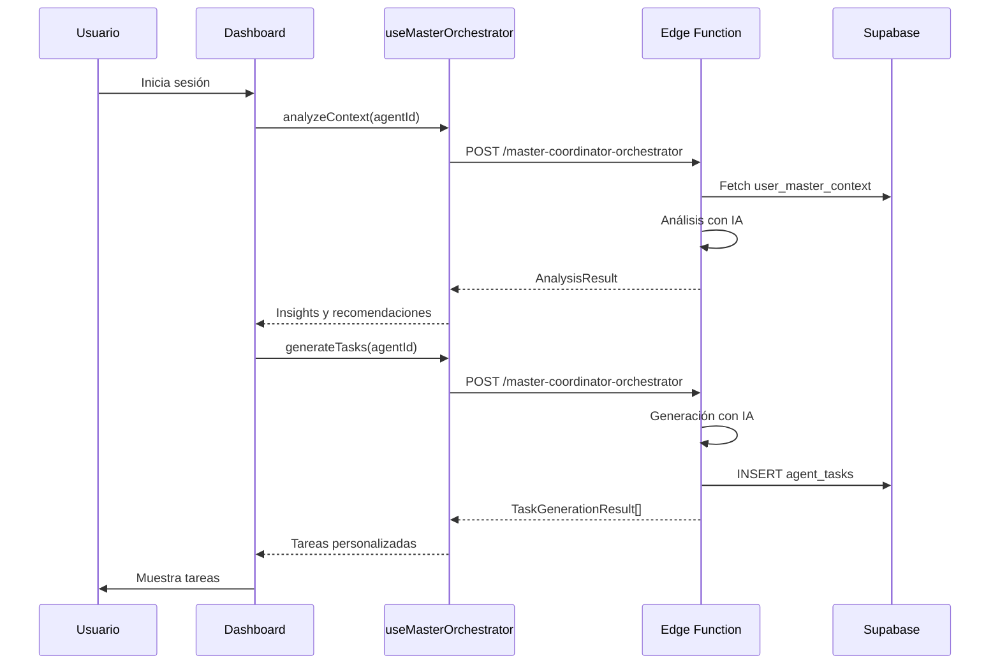
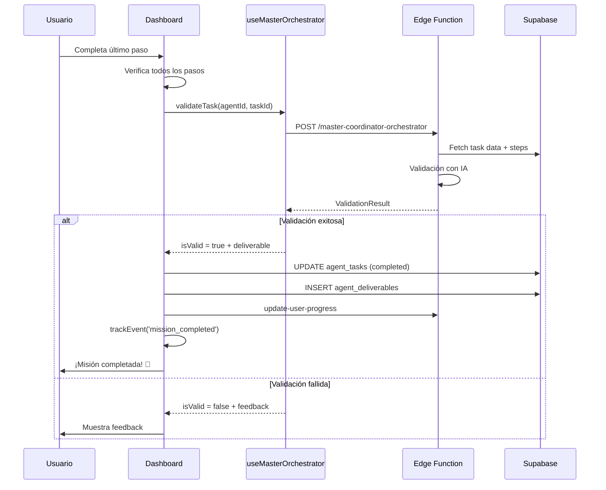

# Sistema de Orchestrator - Documentación Técnica

## Índice
1. [Visión General](#visión-general)
2. [Arquitectura](#arquitectura)
3. [Componentes Principales](#componentes-principales)
4. [Flujos de Datos](#flujos-de-datos)
5. [API y Edge Functions](#api-y-edge-functions)
6. [Analytics e Integración](#analytics-e-integración)
7. [Guía de Uso](#guía-de-uso)
8. [Troubleshooting](#troubleshooting)

---

## Visión General

El **Sistema de Orchestrator** es un framework inteligente de gestión de tareas impulsado por IA que:
- Analiza el contexto del usuario de forma automática
- Genera tareas personalizadas basadas en perfiles y objetivos
- Valida la completitud de tareas usando IA
- Genera entregables automáticos para cada misión completada
- Integra analytics para seguimiento de progreso

### Características Principales
- ✅ Análisis contextual inteligente con IA
- ✅ Generación dinámica de tareas personalizadas
- ✅ Validación automatizada de tareas con feedback
- ✅ Sistema de entregables automáticos
- ✅ Tracking completo de analytics
- ✅ Integración con sistema de progreso y gamificación

---

## Arquitectura

### Diagrama de Componentes

```
┌─────────────────────────────────────────────────────────────┐
│                    Frontend Layer                            │
├─────────────────────────────────────────────────────────────┤
│  NewMasterCoordinatorDashboard                               │
│    ├─ useMasterOrchestrator (Hook principal)                │
│    ├─ useMasterAgent (Context global)                       │
│    ├─ useAnalyticsTracking                                  │
│    └─ UI Components                                         │
└─────────────────────────────────────────────────────────────┘
                            │
                            ▼
┌─────────────────────────────────────────────────────────────┐
│                  Edge Function Layer                         │
├─────────────────────────────────────────────────────────────┤
│  master-coordinator-orchestrator                             │
│    ├─ analyze_context                                       │
│    ├─ generate_tasks                                        │
│    └─ validate_task                                         │
└─────────────────────────────────────────────────────────────┘
                            │
                            ▼
┌─────────────────────────────────────────────────────────────┐
│                    Database Layer                            │
├─────────────────────────────────────────────────────────────┤
│  ├─ user_master_context                                     │
│  ├─ agent_tasks                                             │
│  ├─ task_steps                                              │
│  ├─ agent_deliverables                                      │
│  ├─ user_progress                                           │
│  └─ agent_usage_metrics                                     │
└─────────────────────────────────────────────────────────────┘
```

---

## Componentes Principales

### 1. useMasterOrchestrator Hook

**Ubicación:** `src/hooks/useMasterOrchestrator.ts`

Hook principal que proporciona la interfaz para interactuar con el orchestrator.

#### Funciones Principales

##### analyzeContext(agentId: string)
Analiza el contexto del usuario para un agente específico.

```typescript
const { analyzeContext } = useMasterOrchestrator();

const analysis = await analyzeContext('cultural-strategist');
// Returns: AnalysisResult | null
```

**Retorna:**
```typescript
interface AnalysisResult {
  insights: string;
  recommendations: string[];
  readinessScore: number;
  missingData?: string[];
}
```

##### generateTasks(agentId: string)
Genera tareas personalizadas basadas en el contexto del usuario.

```typescript
const { generateTasks } = useMasterOrchestrator();

const tasks = await generateTasks('cultural-strategist');
// Returns: TaskGenerationResult[] | null
```

**Retorna:**
```typescript
interface TaskGenerationResult {
  title: string;
  description: string;
  category: string;
  estimatedTime: number;
  priority: 'low' | 'medium' | 'high';
  steps: Array<{
    title: string;
    description: string;
    estimatedMinutes: number;
  }>;
}
```

##### validateTask(agentId: string, taskId: string)
Valida la completitud de una tarea usando IA.

```typescript
const { validateTask } = useMasterOrchestrator();

const validation = await validateTask('cultural-strategist', taskId);
// Returns: ValidationResult | null
```

**Retorna:**
```typescript
interface ValidationResult {
  isValid: boolean;
  message: string;
  score: number;
  feedback: string[];
  deliverable?: {
    title: string;
    description?: string;
    content: string;
    type: 'markdown' | 'pdf' | 'text' | 'json';
    validationScore?: number;
  };
  nextSteps?: string[];
}
```

#### Estados de Carga

```typescript
const {
  isAnalyzing,    // true cuando analyzeContext está ejecutándose
  isGenerating,   // true cuando generateTasks está ejecutándose
  isValidating,   // true cuando validateTask está ejecutándose
  isLoading       // true si cualquiera está ejecutándose
} = useMasterOrchestrator();
```

---

### 2. MasterAgentContext

**Ubicación:** `src/context/MasterAgentContext.tsx`

Contexto global que maneja el estado de todos los módulos del sistema.

#### Módulos Disponibles

```typescript
interface MasterAgentState {
  profile: ProfileModule;
  brand: BrandModule;
  shop: ShopModule;
  inventory: InventoryModule;
  pricing: PricingModule;
  growth: GrowthModule;
}
```

#### Funciones Principales

```typescript
const {
  masterState,           // Estado completo de todos los módulos
  refreshModule,         // Refrescar un módulo específico
  syncAll,              // Sincronizar todos los módulos
  invokeAgent,          // Invocar una acción del agente
  getModuleState,       // Obtener estado de un módulo
  isLoading,            // Estado de carga
  error                 // Error si existe
} = useMasterAgent();
```

---

### 3. NewMasterCoordinatorDashboard

**Ubicación:** `src/components/coordinator/NewMasterCoordinatorDashboard.tsx`

Componente principal del dashboard que integra el orchestrator.

#### Funciones Clave

##### handleCompleteTaskStep
Maneja la completitud de pasos de tareas e integra validación con IA.

```typescript
const handleCompleteTaskStep = async (
  taskId: string,
  stepId: string,
  completed: boolean
) => {
  // 1. Actualiza el paso en la DB
  // 2. Si todos los pasos están completos, valida con IA
  // 3. Si la validación es exitosa:
  //    - Marca la tarea como completada
  //    - Guarda el entregable en la DB
  //    - Actualiza el progreso del usuario
  //    - Registra analytics
}
```

**Flujo de Validación:**

```
Usuario completa último paso
          │
          ▼
validateTask() → Edge Function
          │
          ▼
    ¿Validación exitosa?
    │               │
   Sí              No
    │               │
    ▼               ▼
Guardar         Mostrar
entregable      feedback
    │
    ▼
Actualizar
progreso
    │
    ▼
Track
analytics
```

---

## Flujos de Datos

### Flujo 1: Generación Inicial de Tareas



### Flujo 2: Completitud y Validación de Tareas



---

## API y Edge Functions

### master-coordinator-orchestrator

**Ubicación:** `supabase/functions/master-coordinator-orchestrator/index.ts`

Edge function principal que maneja todas las operaciones del orchestrator.

#### Endpoints

##### 1. Análisis de Contexto

**Request:**
```json
{
  "type": "analyze_context",
  "agentId": "cultural-strategist",
  "userId": "uuid",
  "payload": {}
}
```

**Response:**
```json
{
  "status": "success",
  "data": {
    "insights": "Análisis detallado...",
    "recommendations": ["Recomendación 1", "Recomendación 2"],
    "readinessScore": 75,
    "missingData": ["campo1", "campo2"]
  }
}
```

##### 2. Generación de Tareas

**Request:**
```json
{
  "type": "generate_tasks",
  "agentId": "cultural-strategist",
  "userId": "uuid",
  "payload": {}
}
```

**Response:**
```json
{
  "status": "success",
  "data": [
    {
      "title": "Definir Identidad de Marca",
      "description": "...",
      "category": "branding",
      "estimatedTime": 30,
      "priority": "high",
      "steps": [...]
    }
  ]
}
```

##### 3. Validación de Tarea

**Request:**
```json
{
  "type": "validate_task",
  "agentId": "cultural-strategist",
  "userId": "uuid",
  "payload": {
    "taskId": "uuid"
  }
}
```

**Response:**
```json
{
  "status": "success",
  "data": {
    "isValid": true,
    "message": "¡Excelente trabajo!",
    "score": 95,
    "feedback": ["Punto fuerte 1", "Punto fuerte 2"],
    "deliverable": {
      "title": "Plan de Identidad de Marca",
      "content": "# Contenido del entregable...",
      "type": "markdown",
      "validationScore": 95
    },
    "nextSteps": ["Próximo paso 1", "Próximo paso 2"]
  }
}
```

#### Configuración de Seguridad

```toml
[functions.master-coordinator-orchestrator]
verify_jwt = true
```

---

## Analytics e Integración

### Eventos Tracked

#### 1. Eventos de Onboarding

```typescript
// Inicio de assessment
trackEvent({
  eventType: 'assessment_started',
  eventData: { language: 'es' },
  success: true
});

// Block completado
trackEvent({
  eventType: 'onboarding_block_completed',
  eventData: {
    blockNumber: 1,
    timeSpent: 120,
    answersProvided: 5
  },
  success: true
});

// Assessment completado
trackEvent({
  eventType: 'assessment_completed',
  eventData: {
    totalBlocks: 5,
    totalTime: 600,
    maturityScores: {...}
  },
  success: true
});
```

#### 2. Eventos del Orchestrator

```typescript
// Análisis de contexto
trackEvent({
  eventType: 'agent_context_analysis_completed',
  eventData: {
    readinessScore: 75,
    recommendationsCount: 3,
    missingDataFields: 2
  },
  agentId: 'cultural-strategist',
  success: true
});

// Generación de tareas
trackEvent({
  eventType: 'tasks_generated_successfully',
  eventData: {
    tasksCount: 5,
    categories: ['branding', 'marketing'],
    averagePriority: 'high'
  },
  agentId: 'cultural-strategist',
  success: true
});

// Validación de tarea
trackEvent({
  eventType: 'task_validated',
  eventData: {
    isValid: true,
    hasDeliverable: true,
    deliverableType: 'markdown',
    nextStepsCount: 3
  },
  agentId: 'cultural-strategist',
  taskId: 'uuid',
  success: true
});
```

#### 3. Eventos del Dashboard

```typescript
// Vista de paso de tarea
trackEvent({
  eventType: 'task_step_viewed',
  eventData: {
    stepNumber: 1,
    totalSteps: 5
  },
  taskId: 'uuid',
  agentId: 'cultural-strategist',
  success: true
});

// Completitud de paso
trackEvent({
  eventType: 'task_step_completed',
  eventData: {
    stepNumber: 1,
    timeSpent: 300
  },
  taskId: 'uuid',
  agentId: 'cultural-strategist',
  success: true
});

// Misión completada
trackEvent({
  eventType: 'mission_completed',
  eventData: {
    totalSteps: 5,
    timeSpent: 1500,
    hasDeliverable: true,
    deliverableType: 'markdown'
  },
  taskId: 'uuid',
  agentId: 'cultural-strategist',
  success: true
});
```

### Consultas de Analytics

#### Total de misiones completadas por usuario
```sql
SELECT COUNT(*) 
FROM agent_usage_metrics 
WHERE user_id = $1 
  AND created_at >= NOW() - INTERVAL '30 days';
```

#### Tasa de éxito de validaciones
```sql
SELECT 
  COUNT(CASE WHEN success = true THEN 1 END)::float / 
  COUNT(*)::float * 100 as success_rate
FROM agent_usage_metrics
WHERE user_id = $1;
```

---

## Guía de Uso

### Para Desarrolladores

#### 1. Integrar el Orchestrator en un Nuevo Componente

```typescript
import { useMasterOrchestrator } from '@/hooks/useMasterOrchestrator';
import { useAuth } from '@/context/AuthContext';

export const MyComponent = () => {
  const { user } = useAuth();
  const {
    analyzeContext,
    generateTasks,
    validateTask,
    isLoading
  } = useMasterOrchestrator();

  const handleAnalyze = async () => {
    const analysis = await analyzeContext('my-agent-id');
    if (analysis) {
      console.log('Insights:', analysis.insights);
    }
  };

  return (
    <div>
      <button onClick={handleAnalyze} disabled={isLoading}>
        Analizar Contexto
      </button>
    </div>
  );
};
```

#### 2. Crear una Nueva Tarea Manualmente

```typescript
import { supabase } from '@/integrations/supabase/client';

const createTask = async (userId: string, agentId: string) => {
  const { data, error } = await supabase
    .from('agent_tasks')
    .insert({
      user_id: userId,
      agent_id: agentId,
      title: 'Mi Nueva Tarea',
      description: 'Descripción detallada',
      status: 'pending',
      category: 'branding',
      estimated_time: 30,
      priority: 'high'
    })
    .select()
    .single();

  if (error) throw error;
  return data;
};
```

#### 3. Agregar Pasos a una Tarea

```typescript
const addTaskSteps = async (taskId: string, steps: Step[]) => {
  const stepsToInsert = steps.map((step, index) => ({
    task_id: taskId,
    step_number: index + 1,
    title: step.title,
    description: step.description,
    input_type: 'text',
    completion_status: 'pending'
  }));

  const { error } = await supabase
    .from('task_steps')
    .insert(stepsToInsert);

  if (error) throw error;
};
```

### Para Usuarios

#### 1. Iniciar una Nueva Misión

1. Navega al Dashboard del Coordinador
2. El sistema analizará automáticamente tu contexto
3. Se generarán tareas personalizadas basadas en tu perfil
4. Selecciona una tarea para comenzar

#### 2. Completar una Misión

1. Lee cuidadosamente cada paso
2. Completa los pasos en orden
3. Marca cada paso como completado
4. Al completar todos los pasos:
   - El sistema validará tu trabajo con IA
   - Recibirás feedback personalizado
   - Si la validación es exitosa, obtendrás un entregable automático

#### 3. Visualizar Entregables

1. Ve a la sección de "Entregables"
2. Descarga tus documentos generados
3. Revisa el feedback y próximos pasos sugeridos

---

## Troubleshooting

### Problema: La validación siempre falla

**Causas posibles:**
- Los pasos no tienen suficiente información
- El contexto del usuario está incompleto

**Solución:**
1. Verifica que todos los pasos tengan `user_input_data`
2. Completa el perfil del usuario en `user_master_context`
3. Revisa los logs de la edge function

### Problema: No se generan tareas

**Causas posibles:**
- El usuario no tiene suficiente contexto
- Error en la edge function

**Solución:**
1. Ejecuta `analyzeContext` primero
2. Revisa `missingData` en el resultado
3. Completa la información faltante
4. Intenta generar tareas nuevamente

### Problema: El entregable no se guarda

**Causas posibles:**
- Error en la inserción a `agent_deliverables`
- Usuario no autenticado

**Solución:**
1. Verifica que el usuario esté autenticado
2. Revisa los permisos RLS en `agent_deliverables`
3. Verifica la consola del navegador para errores

### Debug Mode

Para habilitar logs detallados:

```typescript
// En el componente
console.log('[DEBUG] Orchestrator state:', {
  isAnalyzing,
  isGenerating,
  isValidating,
  user: user?.id
});

// En la edge function
console.log('[master-coordinator-orchestrator] Request:', {
  type,
  agentId,
  userId
});
```

---

## Mejoras Futuras

### Fase 1 (Corto plazo)
- [ ] Soporte para múltiples idiomas en validación
- [ ] Cache de análisis de contexto
- [ ] Reintentos automáticos en caso de error

### Fase 2 (Mediano plazo)
- [ ] Generación de entregables en PDF
- [ ] Sistema de templates para tareas
- [ ] Integración con calendario

### Fase 3 (Largo plazo)
- [ ] Machine learning para mejorar recomendaciones
- [ ] Colaboración en tiempo real
- [ ] Exportación de progreso a otras plataformas

---

## Referencias

- [Supabase Edge Functions](https://supabase.com/docs/guides/functions)
- [OpenAI API](https://platform.openai.com/docs)
- [React Query](https://tanstack.com/query/latest)
- [Framer Motion](https://www.framer.com/motion/)

---

**Última actualización:** 2025-10-27  
**Versión:** 1.0.0  
**Mantenedor:** Equipo de Desarrollo
